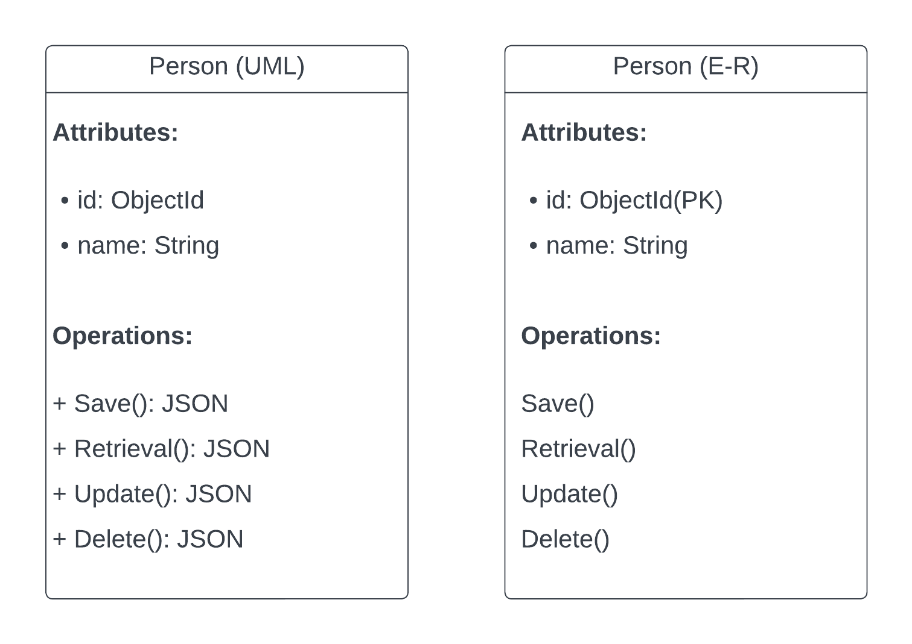
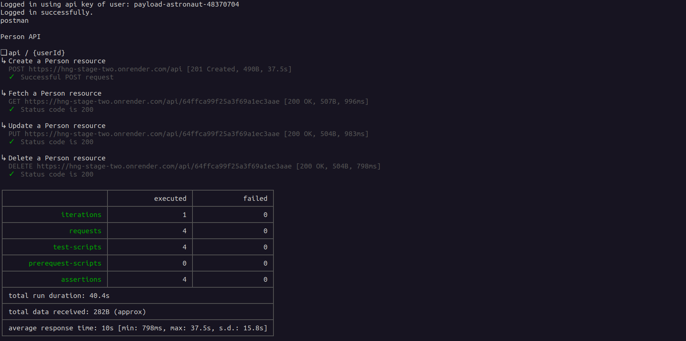

# API Documentation

This document provides detailed information about the API endpoints, request/response formats, sample usage, limitations, and setup instructions.

## UML and E-R Diagram



## API Endpoints

### 1. Fetch a Person Resource

- **Endpoint:** `/api/userId`
- **Method:** `GET`
- **Access:** Public

#### Request

No request body is required. The `userId` parameter should be included in the URL.

#### Response

- `200 OK` if the user is found:

  ```json
  {
    "data": {
      "_id": "1234567890",
      "name": "John Doe",
      // other user properties
    }
  }
  ```

- `404 Not Found` if the user is not found:

  ```json
  {
    "message": "User not found."
  }
  ```

- `400 Bad Request` if `userId` is not in a valid MongoDB ObjectId:

  ```json
  {
    "message": "Invalid ID format"
  }
  ```

- `500 Internal Server Error` for any other server-related errors.

### 2. Create a Person Resource

- **Endpoint:** `/api`
- **Method:** `POST`
- **Access:** Public

#### Request

- Request Body:

  ```json
  {
    "name": "John Doe"
    // other user properties
  }
  ```

#### Response

- `201 Created` if the person is successfully created:

  ```json
  {
    "data": {
      "_id": "1234567890",
      "name": "John Doe",
      // other user properties
    }
  }
  ```

- `400 Bad Request` if the request body is missing or not valid:

  ```json
  {
    "error": "Invalid or missing 'name' field"
  }
  ```

- `500 Internal Server Error` for any other server-related errors.

### 3. Update a Person Resource

- **Endpoint:** `/api/userId`
- **Method:** `PUT`
- **Access:** Public

#### Request

- Request Body:

  ```json
  {
    "name": "Updated Name"
    // other updated user properties
  }
  ```
  
#### Response

- `200 OK` if the person is successfully updated:

  ```json
  {
    "data": {
      "_id": "1234567890",
      "name": "Updated Name",
      // other updated user properties
    }
  }
  ```

- `404 Not Found` if the user is not found:

  ```json
  {
    "error": "User not found."
  }
  ```

- `400 Bad Request` if the request body is missing or not valid, or if `userId` is not in a valid MongoDB ObjectId:

  ```json
  {
    "message": "Invalid ID format"
  }
  ```

- `500 Internal Server Error` for any other server-related errors.

### 4. Delete a Person Resource

- **Endpoint:** `/api/userId`
- **Method:** `DELETE`
- **Access:** Public

#### Request

No request body is required. The `userId` parameter should be included in the URL.

#### Response

- `200 OK` if the person is successfully deleted:

  ```json
  {
    "data": {
      "_id": "1234567890",
      "name": "Deleted User",
      // other deleted user properties
    }
  }
  ```

- `404 Not Found` if the user is not found:

  ```json
  {
    "message": "User not found."
  }
  ```

- `400 Bad Request` if `userId` is not in a valid MongoDB ObjectId:

  ```json
  {
    "message": "Invalid ID format"
  }
  ```

- `500 Internal Server Error` for any other server-related errors.

## Sample Usage

### Fetch a Person Resource (GET)

**Request:**

```http
GET /api/1234567890
```

**Response (200 OK):**

```json
{
  "data": {
    "_id": "1234567890",
    "name": "John Doe",
    // other user properties
  }
}
```

### Create a Person Resource (POST)

**Request:**

```http
POST /api
Content-Type: application/json

{
  "name": "Jane Smith"
  // other user properties
}
```

**Response (201 Created):**

```json
{
  "data": {
    "_id": "0987654321",
    "name": "Jane Smith",
    // other user properties
  }
}
```

### Update a Person Resource (PUT)

**Request:**

```http
PUT /api/1234567890
Content-Type: application/json

{
  "name": "Updated Name"
  // other updated user properties
}
```

**Response (200 OK):**

```json
{
  "data": {
    "_id": "1234567890",
    "name": "Updated Name",
    // other updated user properties
  }
}
```

### Delete a Person Resource (DELETE)

**Request:**

```http
DELETE /api/1234567890
```

**Response (200 OK):**

```json
{
  "data": {
    "_id": "1234567890",
    "name": "Deleted User",
    // other deleted user properties
  }
}
```

## Testing

API endpoints can be tested easily using [Postman's CLI tool](https://learning.postman.com/docs/postman-cli/postman-cli-installation/) with the command below

```bash
postman login --with-api-key <replace-with-postman-api-key>
postman collection run 29666150-9190139c-e5db-45b3-88ea-a924541b801d
```

Postman CLI output:


## Known Limitations and Assumptions

- The API assumes that the `userId` parameter is a valid MongoDB ObjectId.
- No authentication or authorization mechanisms are implemented (public access).
- Initial request to server may delay a bit because Render server instances are spinned down after some minutes of inactivity.

## Setup

To set up and deploy the API locally or on a server, follow these steps:

1. Clone the repository containing the API code.
2. Install the required dependencies using a package manager like npm or yarn.
3. Configure the MongoDB connection string in the `.env` file.
4. Start the API server using the appropriate command (e.g., `npm run start`).
5. The API will be available at the specified base URL (e.g., `http://localhost:PORT`).

<mark>For more detailed setup instructions see</mark>:  [README.md](./README.md)

Ensure that you have Node.js and MongoDB installed on your system before proceeding with the setup.
